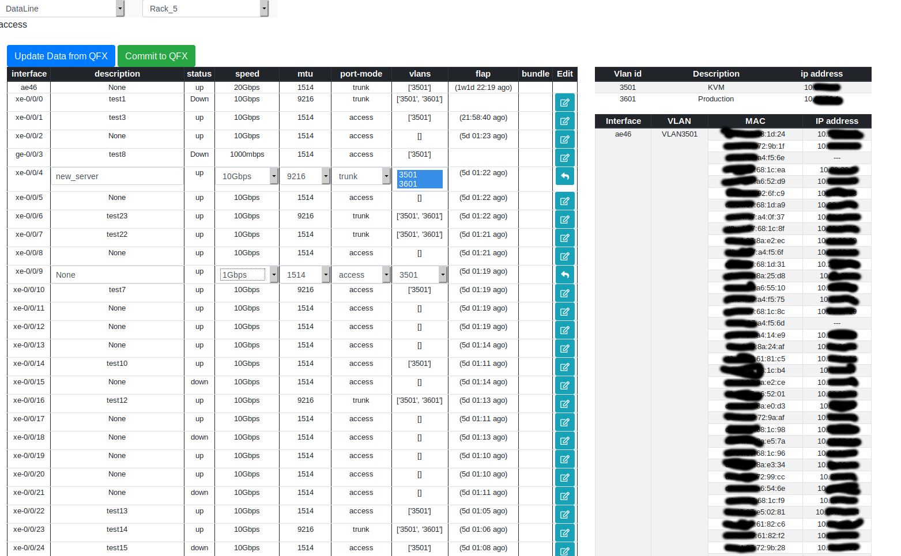

Эта программа предназначена для ленивых сетевиков и дотошных админов.

Позволяет настраивать порты, а также просматривать различную информацию(mac, ip, ports) на коммутаторах Juniper.

Протестировано на коммутаторах серий: EX2300, QFX5110.

